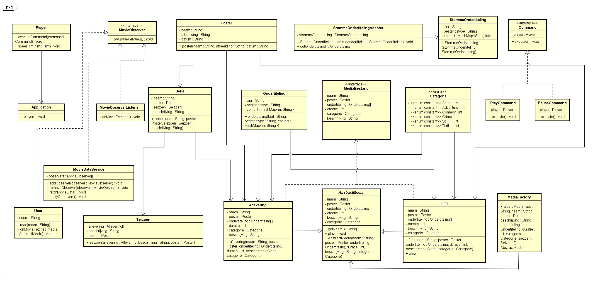

# Het project

**Streamingdienst NetNix.**

De streamingsdienst netnix biedt een breed schala aan films en series.

# Design patterns

**Adapter pattern** wordt gebruikt om stomme ondertiteling bestanden die niet compatible zijn met de mediaspeler te adapten naar normale ondertiteling.

**Command pattern** wordt gebruikt om verschillende commando’s uit te voeren in de media player.

**Observer pattern** wordt gebruikt om de MovieDataService te observeren voor veranderingen in de externe datavoorziening

**Factory method** wordt gebruikt om van de verschillende data uit de FilmDataService te verwerken naar Film en Serie objecten.

# Class diagram:
